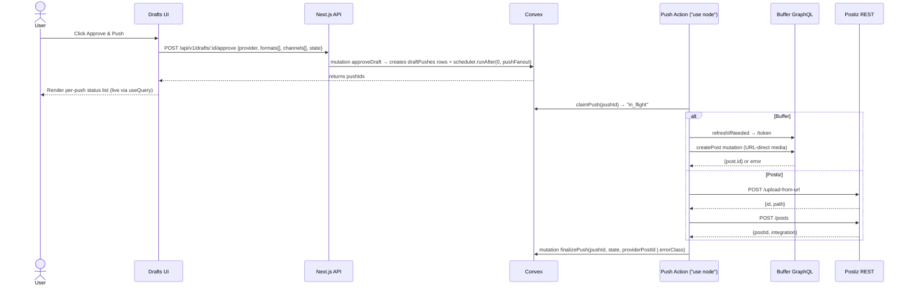

# feat: Buffer + Postiz BYO posting

## Overview

Add a BYO (bring-your-own) posting backbone to bragfast. Users connect their existing Buffer (OAuth 2.0) and/or Postiz (API key + instance URL) account in Settings → Integrations. Routing defaults map each render format (Square / Landscape / Portrait + video equivalents) to a default set of channels per provider. On Approve, an Approve modal lets the user confirm/override provider, format→channel grid, and `Add to queue` vs `Save as draft`. The backend fans out one push per (format × channel × provider) tuple via a Convex `"use node"` `internalAction`. Each push is a row in a new `draftPushes` table; status, errors, and retries are visible per row in the draft detail view.

bragfast holds only the user's Buffer OAuth tokens and Postiz API key — never platform tokens (X, LinkedIn, etc.). Provider hosting (Postiz) is the user's problem, not ours.

---

## Problem Frame

bragfast generates carousel images and videos but cannot publish them. Drafts pile up; founders manually copy text + download image + paste into Buffer/Postiz/X/LinkedIn one-by-one. The "autopilot" promise terminates at a to-do list.

The previous attempt (`docs/plans/2026-04-28-001-feat-postiz-posting-backbone-plan.md`, now superseded) chose to host Postiz ourselves. That direction was rejected in `docs/brainstorms/2026-04-28-buffer-postiz-byo-posting-requirements.md` because operating Postiz infra doesn't fit the product. BYO is the new direction: integrate with whatever the user already uses.

---

## Requirements Trace

- R1. Users connect Buffer via OAuth 2.0 in <60s; channel list populates automatically. (origin: Success Criteria)
- R2. Users connect Postiz (Cloud + self-hosted) with instance URL + API key in <60s; channel list populates automatically. (origin: Success Criteria)
- R3. Approve modal pre-fills format→channel selections from routing defaults; one-click confirm hits ≥80% of approvals. (origin: Success Criteria)
- R4. Approve → all selected pushes reach provider queue/drafts in <10s; each push status reflected per-row. (origin: Success Criteria + Flow step 5)
- R5. Failed pushes are visible and one-click retryable; transient failures auto-retry. (origin: Failure Modes)
- R6. Zero platform tokens (X, LinkedIn, IG, etc.) stored in bragfast Convex. (origin: Outside This Product's Identity)
- R7. Disconnecting a provider removes the secret + clears routing entries that referenced its channels. (origin: Success Criteria)
- R8. User picks per-draft which provider(s) receive the push when both are connected. (origin: Decisions Locked)
- R9. User picks per-draft post state: queue or draft. (origin: Decisions Locked)
- R10. Format→channel mapping uses smart defaults + per-draft override grid. (origin: Decisions Locked)
- R11. Video drafts use the same approve→push flow as image drafts (MVP). (origin: Decisions Locked)

**Origin actors:** indie maker who already uses Buffer and/or Postiz.
**Origin flows:** Connect provider → Configure routing defaults (optional) → Approve draft → Backend fan-out → Per-push status visible.

---

## Scope Boundaries

- bragfast does not host Postiz or any posting infra.
- bragfast does not build a scheduling calendar or per-platform editor.
- bragfast does not auto-post (no kill-window flow). Approve is always explicit.
- bragfast does not ingest engagement metrics back from providers (likes, views, comments).
- No providers beyond Buffer + Postiz in MVP.
- No Haiku-driven per-channel copy variants. Single `{title, description}` to all channels; user edits per-channel inside provider before publish.
- No bulk-approve across multiple drafts in MVP.

### Deferred to Follow-Up Work

- Auto-post with kill window: lands once approve→push is stable.
- Engagement loop: depends on provider analytics access.
- Per-channel copy variants generated by Haiku.
- Inline per-channel copy editing in approve modal.
- Additional providers (Hootsuite, Typefully, etc.).
- Bulk approve.

---

## Context & Research

### Relevant Code and Patterns

- `convex/schema.ts:172-194` — `integrationSecrets` table (sealed credential pattern). Provider union extended in 9 callsites in `convex/integrationSecrets.ts` (lines 11-15, 17, 80, 95, 139, 158, 173, 202, 217).
- `src/lib/crypto/secret-box.ts` — AES-256-GCM `seal()` / `open()`. Single-string-per-row payload.
- `src/app/api/v1/sous-chef/integrations/route.ts:71-128` — connect flow template: authenticate → seal → upsertAction → probe → rollback on probe failure (Stripe model).
- `src/components/admin/integration-forms.tsx` — `ConnectDialog` (modal) + `InlineIntegrationForm` (embedded). Postiz paste-key UI mirrors this verbatim.
- `convex/videoRender.ts` — canonical `"use node"` `internalAction` outbound HTTP. Use as template for the push action.
- `convex/releases.ts:124-149` — fire-and-forget pattern: `ctx.scheduler.runAfter(0, internal.X.Y, args)` from a mutation.
- `src/lib/video/lambda.ts:18-44` — `withRetry(fn, label, maxRetries=3, baseDelayMs=5000)` exponential backoff helper. Replicate for Buffer/Postiz HTTP calls.
- `src/components/admin/sous-chef-client.tsx:188-249` — connected/disconnected status badge + scan error display. Reuse pattern for per-push status row.
- `src/components/admin/pixel-table.tsx`, `pixel-card.tsx`, `pixel-button.tsx` — NES-retro UI primitives (border-2 brand, hard 4px shadow, no border-radius, Press Start 2P).
- `src/app/(admin)/admin/drafts/page.tsx` + `src/components/admin/drafts-client.tsx` — drafts grid. Approve button + push-status panel insert into the `DraftCard` or a new draft detail page.
- `src/lib/storage/r2.ts:98-107` — uploads return permanent public URLs (`${R2_PUBLIC_URL}/${key}`), `Cache-Control: public, max-age=31536000, immutable`. Buffer can fetch these directly.
- `src/app/api/github/callback/route.ts` — sole existing OAuth-style callback. Useful only as **route shape**; the OAuth 2.0 + state CSRF + code-exchange logic is net new.

### Institutional Learnings

- `docs/solutions/` has no formal entry covering OAuth, sealed-credential dual-token, or `"use node"` outbound HTTP. Capture solution docs post-merge for: Buffer OAuth + state CSRF, dual-token sealing, Convex `"use node"` outbound HTTP pattern, claimPush atomic state-machine.
- The superseded plan `docs/plans/2026-04-28-001-feat-postiz-posting-backbone-plan.md` locked some decisions worth carrying forward: `claimPush` atomic mutation pattern (Convex serializes mutations — concurrent approve clicks naturally fail one), retry-3x-with-backoff for the post-success DB write, structured `[push:<releaseId>]` log prefix.

### External References

- Buffer GraphQL API: `https://developers.buffer.com/`
  - Auth: OAuth 2.0 (Authorization Code + PKCE optional). Endpoint pair: `https://auth.buffer.com/auth` (authorize), `https://auth.buffer.com/token` (exchange + refresh). Single API endpoint: `POST https://api.buffer.com` (GraphQL body).
  - Access tokens 3,600s. Refresh tokens **rotate on every use** — store the new refresh token from every `/token` response immediately. Reusing a stale refresh token revokes the entire grant. Request `offline_access` scope.
  - Scopes needed: `posts:read posts:write account:read offline_access`.
  - Channels: `query { channels(input: { organizationId }) { id service displayName isDisconnected } }`.
  - createPost mutation. `mode: addToQueue | shareNow | shareNext | customScheduled`. `saveToDraft: true` flips the same mutation to draft state. Media via `assets.images[].url` (URL fetched by Buffer; no binary upload).
  - Rate limits: 100 req / 15 min per OAuth client (across all bragfast users), 2000 / 15 min per account. **The per-client cap is a real ceiling at scale; treat as an open operational risk for fanout.**
  - Video: schema lists `videos` in `AssetsInput` but Buffer's roadmap notes "Video uploads are not supported via the public API" (ambiguous scope; may apply to `createIdea` only). **Video via Buffer is unverified — image-only on the Buffer side in MVP. See Risks.**
- Postiz REST API: `https://docs.postiz.com/public-api/introduction`
  - Auth: `Authorization: <api-key>` header (no `Bearer` prefix). Per-organization key.
  - Cloud base: `https://api.postiz.com/public/v1`. Self-hosted: `https://{user-instance}/public/v1`. Same contract.
  - Channels: `GET /integrations` → `[{id, identifier, name, picture, disabled, profile, ...}]`. `identifier` is the platform string (`"x"`, `"linkedin"`, `"instagram"`, `"tiktok"`, `"threads"`, etc.).
  - Create post: `POST /posts` with `{ type: "schedule" | "now" | "draft", date, posts: [{ integration: {id}, value: [{content, image: [{id, path}]}], settings: {__type: "<platform>"} }] }`. `date` required even for `now`/`draft`. `find-slot/:integrationId` returns next available slot.
  - Media: 2-step. `POST /upload-from-url { url }` → `{id, path}`. Reference id+path in post body. Video supported through same flow.
  - Rate: 30 requests / hour per API key. **Tight ceiling — must throttle aggressively per-user.**
  - Known issues: MP4 extension mutation (issue #1112, lowercase-only), upload-from-url path extension fix (PR #1207). Confirm user's Postiz version is recent.

---

## Key Technical Decisions

- **OAuth token storage shape (Buffer):** Seal a single JSON string `{accessToken, refreshToken, expiresAt}` as the row's `ciphertext`. Fits existing single-blob-per-row schema. No schema migration needed beyond the provider literal. Resolves origin question #2.
- **Postiz instance URL storage:** Plaintext in `extra` JSON (`{instanceUrl, channels}`). Not secret. Postiz API key is sealed in the row's ciphertext.
- **Postiz `instanceUrl` SSRF defense:** A user-supplied URL is an SSRF vector — without validation an attacker can target `http://169.254.169.254` (cloud metadata), `http://127.0.0.1`, or RFC-1918 ranges and exfiltrate creds or hit internal services. All Postiz HTTP calls must go through a single helper (`src/lib/integrations/postiz/client.ts`) that, before issuing the request:
  1. Reject if scheme is not `https` (allow `http` only when `NODE_ENV === "development"` for self-hosted dev).
  2. DNS-resolve the hostname.
  3. Reject if **any** resolved IP falls in: `127.0.0.0/8`, `10.0.0.0/8`, `172.16.0.0/12`, `192.168.0.0/16`, `169.254.0.0/16` (incl. AWS IMDS `169.254.169.254`), `100.64.0.0/10`, `0.0.0.0/8`, `::1/128`, `fc00::/7`, `fe80::/10`, `::ffff:0:0/96` (IPv4-mapped IPv6 of any blocked v4 range).
  4. Pin the resolved IP in the request (defeats DNS rebinding) — use a custom `lookup` in the fetch agent.
  5. Cap response size + apply a 10s timeout.
- **Per-user Postiz call boundary:** Net effect of #4 is that every Postiz call must go through this helper; no direct `fetch(instanceUrl + "/...")` anywhere else.
- **Provider union extension:** Add `"buffer"` and `"postiz"` to the `provider` v.union at all 9 callsites in `convex/integrationSecrets.ts` plus `convex/schema.ts`. TypeScript will enforce at build.
- **Channel cache:** On connect, fetch and cache the channel list in `extra` JSON. Refresh on every approve attempt (cheap call) and on a daily cron. Stale entries surfaced as warnings; pushes to disappeared channels return `errorClass: "channel_gone"` and are auto-pruned from routing defaults.
- **Routing defaults storage:** New `routingDefaults` table keyed by `userId` + `format`. Stores `channels: { provider, channelId }[]`. Indexed lookup; mutates often (settings page) so a JSON blob on `userProfiles` is rejected. Resolves origin question #3.
- **Push state model:** New `draftPushes` table. One row per `(draftId, format, provider, channelId)` tuple. Statuses: `pending → in_flight → queued | drafted | failed`. Captures `providerPostId`, `errorClass`, `errorMessage`, `attempts`, `lastAttemptAt`. Indexed by `draftId` and by `userId + status` (for retry sweeps).
- **Push pipeline:** Approve mutation creates pending `draftPushes` rows + schedules a single `internalAction` (`"use node"`) that iterates rows it owns. Per-row claim via atomic `claimPush` mutation (status check `pending` → `in_flight`) prevents double-fire from concurrent approves or retries.
- **Media handoff:**
  - Buffer: hand R2 public URL directly in `assets.images[].url`. No upload step.
  - Postiz: `POST /upload-from-url { url: <r2-url> }` → `{id, path}`, then reference both in `posts[].value[].image[]`. Two HTTP calls per push.
- **Retry policy:** Bounded auto-retry (3 attempts, exponential backoff via `withRetry` helper) for transient errors (5xx, 429, network). After exhaustion, status=`failed` with `errorClass`. Manual retry button on draft detail row resets attempts and re-schedules the action. 401/403 (token expired or revoked) skips retry — surfaces "Reconnect Buffer/Postiz" CTA.
- **Buffer token refresh (refresh-lease pattern):** A bare atomic `refreshBufferToken` mutation is **insufficient** — Buffer rotates the refresh token on every `/token` call, so two concurrent pushes that both detect near-expiry and both call `/token` cause the second to invalidate the first's freshly-stored refresh token, revoking the entire grant. Use a refresh-lease instead:
  1. `claimRefreshLease(provider, userId)` mutation — atomic CAS: if `refreshInProgress` is unset OR `leaseUntil < now`, set `{refreshInProgress: true, leaseUntil: now + 30s}` and return `{owned: true, currentSealed}`. Else return `{owned: false}`.
  2. Owner thread calls `/token`, then `commitRefresh(provider, userId, newSealed)` which seals the new pair and clears the lease in one mutation.
  3. Non-owner threads poll `getSealed(provider, userId)` every 500ms (cap 30s) waiting for `expiresAt > now + 60s`, then proceed with the freshly-stored token.
  4. Lease auto-expires at `leaseUntil` to defend against owner action timeout. On 401 from `/token`, owner clears the lease + marks provider disconnected.
- **Refresh-lease applies only to Buffer.** Postiz uses a static API key — no refresh path.
- **State CSRF + session-binding for Buffer OAuth:** Generate random `state` nonce, store in `oauthStates` row keyed by userId (TTL 10 min) before redirecting to Buffer. On callback, **two checks** must both pass before exchanging code:
  1. `consumeState(state)` returns a row whose `userId` matches.
  2. The callback re-runs `authenticate()` (session cookie) and asserts `session.userId === state.userId`. **State nonce alone is insufficient** — without this check, an attacker can pre-issue state for their own account, lure a logged-in victim to the callback URL, and bind the attacker's Buffer to the victim's bragfast (or vice versa).
  Reject any mismatch with 403.
- **R2 URL access:** Already public + permanent + immutable per `src/lib/storage/r2.ts:98-107`. No bucket policy change needed. Resolves origin question #6.
- **No bragfast-side `scheduled_at`:** MVP only supports queue and draft. Custom-scheduled adds UX complexity (date picker, timezone) without strong demand. Stays in Deferred.
- **Rate-limit handling:** Per-provider in-process rate limiter (token bucket) inside the push action. Buffer: respect 100/15min OAuth-client global. Postiz: respect 30/hr per key (per-user). On 429, push goes back to `pending` with delayed re-schedule via `ctx.scheduler.runAfter(retryAfterMs, ...)`.

---

## Open Questions

### Resolved During Planning

- Token storage shape: dual-token JSON sealed as one ciphertext (origin Q2).
- Routing defaults: new table, not JSON blob (origin Q3).
- R2 access: already public+permanent (origin Q6).
- Approve modal default UX: hide unchecked rows behind a "Show all channels" toggle; pre-checked rows visible by default to keep the grid scannable (origin Q7).
- Channel-list refresh cadence: on connect + on every approve + daily cron (origin Q4).
- Retry policy: bounded auto + manual after exhaustion (origin Q5).

### Deferred to Implementation

- Buffer OAuth app credentials (production vs preview-deploy redirect URIs): set up at implementation time, not encoded in plan. Likely uses a single redirect URI per env, with `localhost:3000`, preview deploy URL, and prod URL all registered.
- Postiz `settings` `__type` value per platform identifier: derive from `integrations[i].identifier` at push time. Most platforms accept `{__type: <identifier>}`. Instagram and LinkedIn need richer settings — defer per-platform fine-tuning to implementation; start with the minimal `{__type}` form and iterate based on Postiz response.
- Buffer GraphQL response error parsing helper shape: single utility that distinguishes top-level `errors[].extensions.code` from typed payload variants (`MutationError`). Implement when first push fails.
- `MP4` extension normalization for Postiz uploads: lowercase before sending; covered by R2 key naming convention already.
- Operational rate-limit ceiling for Buffer at scale: Buffer's 100/15min per-OAuth-client cap is shared across all bragfast users. Resolution may require a server-side queue or a higher-tier OAuth app. Defer until first scale-pain signal.

---

## High-Level Technical Design

> *This illustrates the intended approach and is directional guidance for review, not implementation specification. The implementing agent should treat it as context, not code to reproduce.*



**Approve modal shape (sketch, not spec):**

```
Approve & Push — Draft #42
─────────────────────────────────
Provider: [x] Buffer  [ ] Postiz   ← pre-checked if connected

Format → Channels                        (toggle: hide unchecked)
  Square      [x] X (Buffer)        [x] LinkedIn (Buffer)
  Landscape   [ ] X (Buffer)        [x] LinkedIn (Buffer)
  Portrait    [x] IG (Postiz)       [x] TikTok (Postiz)

State: ( ) Add to queue   ( ) Save as draft

[ Cancel ]                                      [ Confirm ]
```

---

## Implementation Units

### Phase A — Foundation

- U1. **Schema + provider union extension**

**Goal:** Add Buffer + Postiz providers to the integration secrets schema; add `routingDefaults` and `draftPushes` tables.

**Requirements:** R1, R2, R4, R5, R7, R8, R9, R10

**Dependencies:** none

**Files:**
- Modify: `convex/schema.ts` (extend `integrationSecrets.provider` union; add `routingDefaults` + `draftPushes` tables)
- Modify: `convex/integrationSecrets.ts` (extend local `provider` v.union at all 9 callsites; expose `extra` field on `listByUser` query at lines 61-77 — current shape strips it, blocking U7 approve modal channel-cache read)
- Modify: `convex/sousChef.ts` (extend `sousChefProvider` union at lines 5-10 to include `"buffer"` and `"postiz"`; without this, the `seedAction` call inside the Postiz/Buffer connect path throws)
- Modify: `src/app/api/v1/sous-chef/integrations/route.ts` (extend the DELETE provider whitelist at lines 148-153 — currently hardcodes `stripe|posthog|ga4`, so disconnect of buffer/postiz returns 400)
- Modify: `src/components/admin/integration-forms.tsx` (extend `Provider` type union at line 6 — currently `"stripe" | "posthog" | "ga4"`; ConnectDialog will not render new providers without this)
- Test: `convex/__tests__/schema.test.ts` (if pattern exists; otherwise lean on `npm run build` typegen as the verification surface)

**Approach:**
- `integrationSecrets.provider`: add `v.literal("buffer")` and `v.literal("postiz")`. Add optional `refreshInProgress: v.optional(v.boolean())` and `leaseUntil: v.optional(v.number())` columns for the Buffer refresh-lease (used only for `provider: "buffer"` rows).
- `routingDefaults` table: `{userId, format ("square"|"landscape"|"portrait"|"video-square"|"video-landscape"|"video-portrait"), channels: v.array(v.object({provider: v.union(buffer|postiz), channelId: v.string()})), updatedAt}`. Index `by_userId_format`.
- `draftPushes` table: `{draftId, userId, format, provider, channelId, channelLabel (denorm), state ("pending"|"in_flight"|"queued"|"drafted"|"failed"), providerPostId (optional), errorClass (optional: "auth"|"channel_gone"|"rate_limit"|"media"|"transient"|"unknown"), errorMessage (optional), attempts, lastAttemptAt, createdAt, updatedAt}`. Index `by_draftId`, `by_userId_state`.
- Buffer's `extra` JSON shape (TS comment, not enforced): `{ organizationId, channels: [{id, service, displayName, isDisconnected}], expiresAt }`. The sealed ciphertext holds `{accessToken, refreshToken, expiresAt}` — `expiresAt` duplicated outside ciphertext for fast read without unsealing.
- Postiz's `extra` JSON shape: `{ instanceUrl, channels: [{id, identifier, name, profile, disabled}] }`.

**Patterns to follow:**
- Existing provider union at `convex/schema.ts:174-178`.
- Index naming convention `by_*` from `convex/schema.ts`.

**Test scenarios:**
- Test expectation: none — pure schema/typegen change. Verification via `npm run build` (Convex codegen) succeeding with new providers and tables.

**Verification:**
- `npm run build` succeeds.
- New tables visible in Convex dashboard after deploy.

---

- U2. **Buffer OAuth flow: initiate + callback + token refresh**

**Goal:** Build the OAuth 2.0 Authorization Code flow with state CSRF, exchanging code for `{accessToken, refreshToken, expiresAt}`, sealing as one JSON ciphertext, and a refresh helper.

**Requirements:** R1, R6

**Dependencies:** U1

**Files:**
- Create: `src/app/api/integrations/buffer/start/route.ts` (GET — generates state, stores it, redirects to `https://auth.buffer.com/auth?response_type=code&client_id=...&redirect_uri=...&scope=...&state=...`)
- Create: `src/app/api/integrations/buffer/callback/route.ts` (GET — validates state, exchanges code, fetches org+channels, calls upsertAction with sealed JSON, redirects to `/admin/account?connected=buffer`)
- Create: `src/lib/integrations/buffer/oauth.ts` (token exchange, refresh, organizationId fetch helpers)
- Create: `src/lib/integrations/buffer/graphql.ts` (single GraphQL fetch helper: builds body, sets Authorization, parses errors)
- Create: `convex/oauthState.ts` (`internalMutation issueState`, `internalMutation consumeState` — atomic single-use delete; short-lived CSRF nonces, TTL 10 min)
- Modify: `convex/schema.ts` (add `oauthStates` table: `{userId, state, provider, createdAt, expiresAt}`, indexed `by_state`)
- Modify: `convex/integrationSecrets.ts` (add refresh-lease mutations: `claimRefreshLease`, `commitRefresh`, plus `internalQuery getSealed`. Add `refreshInProgress: boolean` and `leaseUntil: number` columns to `integrationSecrets` schema in U1.)
- Test: `src/lib/integrations/buffer/__tests__/oauth.test.ts`

**Approach:**
- Start route: authenticate user (existing `authenticate()`), generate `state` (32 bytes hex), call `convex.mutation(api.oauthState.issueState, {userId, provider: "buffer", state})`, redirect to Buffer authorize URL with `redirect_uri` pointing at our callback. Scopes: `posts:read posts:write account:read offline_access`.
- Callback route: **first** call `authenticate()` (session cookie) — if no session, redirect to `/login?redirect=/api/integrations/buffer/callback?...` (preserving query). **Second** call `consumeState(state)` (atomic single-use) and assert returned `userId === session.userId`; mismatch → 403. **Third** exchange `code` at `https://auth.buffer.com/token`, parse response to `{access_token, refresh_token, expires_in}`, compute `expiresAt = now + expires_in*1000`, fetch organizationId + channels via GraphQL, seal `JSON.stringify({accessToken, refreshToken, expiresAt})`, call `convex.action(api.integrationSecrets.upsertAction, {provider: "buffer", ciphertext, iv, tag, extra: JSON.stringify({organizationId, channels, expiresAt})})`, redirect to `/admin/account?connected=buffer`.
- Refresh helper (`src/lib/integrations/buffer/oauth.ts:refreshBufferToken`): given current sealed payload, call `/token` with `grant_type=refresh_token`, get new pair, **immediately store** (rotation rule), return new access token. On 401 → throw `BufferRefreshFailed` and caller marks provider disabled.
- GraphQL helper: applies `Authorization: Bearer <token>`, throws `BufferAuthError` on `UNAUTHORIZED`, returns parsed `data`. Handles GraphQL-level `errors[]` and typed mutation-payload errors uniformly.
- Env vars: `BUFFER_CLIENT_ID`, `BUFFER_CLIENT_SECRET`, `BUFFER_REDIRECT_URI`. Document in `.env.example`.

**Execution note:** Start with a unit test that fakes `https://auth.buffer.com/token` and asserts: success path stores new tokens, refresh-token reuse path detects revocation, response with rotated refresh token persists the new value.

**Patterns to follow:**
- Connect flow rollback: `src/app/api/v1/sous-chef/integrations/route.ts:71-128` — authenticate → seal → upsert → probe → on probe failure call `disconnectAction`.
- Sealed-secret API contract: `src/lib/crypto/secret-box.ts`.

**Test scenarios:**
- Happy path: callback with valid state + valid code stores sealed token + channel list; redirect URL is correct.
- Edge case: callback with no state → 400.
- Edge case: callback with mismatched/expired state → 400, no DB write.
- Edge case: callback with state belonging to a different user (session swap — attacker pre-issues state for their account, victim hits callback) → 403, no DB write, state row consumed.
- Edge case: callback with no active session → redirect to `/login?redirect=...`, state preserved (do not consume on this path).
- Error path: code-exchange returns 400 → user redirected with `?error=invalid_code`, no DB write.
- Error path: probe (org+channels fetch) fails → `disconnectAction` called, redirect with `?error=probe_failed`.
- Happy path: refresh helper rotates tokens — stores new pair atomically.
- Error path: refresh returns 401 (revoked grant) → throws `BufferRefreshFailed`; integration disconnected on next push.
- Integration scenario: rotated refresh token reuse — old refresh is rejected; provider must be reconnected.

**Verification:**
- A real round-trip with a test Buffer account completes Connect flow and lists channels.
- Refreshing a near-expiry token rotates and stores the new pair.

---

- U3. **Postiz connect flow (paste URL + API key)**

**Goal:** Add Postiz to the existing Sous-Chef integrations connect surface. Paste-key modal collects instance URL + API key; probe verifies and fetches channels.

**Requirements:** R2, R6

**Dependencies:** U1

**Files:**
- Modify: `src/app/api/v1/sous-chef/integrations/route.ts` (add `provider: "postiz"` branch — accepts `{instanceUrl, apiKey}`, probes `GET /integrations`, stores sealed apiKey + extra JSON)
- Create: `src/lib/integrations/postiz/client.ts` (REST helper: `listIntegrations`, `uploadFromUrl`, `createPost`, `findSlot`)
- Modify: `src/components/admin/integration-forms.tsx` (extend `ConnectDialog` to support a Postiz form variant: instance URL field defaults to `https://api.postiz.com`, API key field, validation, error display)
- Test: `src/lib/integrations/postiz/__tests__/client.test.ts`
- Test: `src/app/api/v1/sous-chef/integrations/__tests__/postiz-connect.test.ts`

**Approach:**
- Probe step: `GET ${instanceUrl}/public/v1/integrations` with `Authorization: ${apiKey}`. On 200, extract `[{id, identifier, name, picture, disabled, profile}]` into the `extra` JSON. On 401 → 400 "key rejected". On network/timeout → 504. On any failure after `upsertAction` succeeded, call `disconnectAction`.
- `instanceUrl` normalization: strip trailing `/`, reject if missing scheme.
- **SSRF guard (see Key Decisions):** all Postiz HTTP from `src/lib/integrations/postiz/client.ts` must go through a `safeFetch(instanceUrl, ...)` wrapper that (a) requires `https` outside dev, (b) DNS-resolves and rejects private/loopback/link-local/IMDS ranges, (c) pins the resolved IP into the request to defeat rebinding, (d) caps response + timeout. Connect-time probe AND every push call uses the same wrapper.
- Postiz client uses `Authorization: <apiKey>` (no `Bearer`) — codify this in the helper to prevent regressions.

**Patterns to follow:**
- Stripe connect path in `src/app/api/v1/sous-chef/integrations/route.ts`.
- `ConnectDialog` modal shell.

**Test scenarios:**
- Happy path: valid URL + key → row created; channels populated in `extra`.
- Edge case: trailing slash in URL — normalized.
- Edge case: missing scheme — 400 with helpful error.
- Edge case: `http://` URL outside dev — 400 "https required".
- Edge case: hostname resolves to `169.254.169.254` (IMDS) — 400 "instance URL not reachable".
- Edge case: hostname resolves to `127.0.0.1` / `10.x.x.x` / `192.168.x.x` — 400.
- Edge case: DNS rebinding attempt (probe resolves public, push resolves private) — pinned-IP fetch defeats; integration test with controlled rebinding host.
- Error path: 401 from Postiz → 400 "key rejected", no row created.
- Error path: network timeout → 504, row rolled back if upsert already happened.
- Edge case: Postiz returns empty integrations array — row created with `channels: []`; UI surfaces "Connect channels in Postiz first".
- Integration scenario: disconnect then reconnect — old row removed, new row created cleanly.

**Verification:**
- Connecting a real Postiz Cloud account populates channels.
- Connecting a self-hosted Postiz instance with custom URL works identically.

---

- U4. **Channel cache + refresh helper**

**Goal:** Single helper that refreshes a provider's cached channel list. Called on connect, on every approve attempt, and from a daily cron.

**Requirements:** R5, R7

**Dependencies:** U2, U3

**Files:**
- Create: `src/lib/integrations/refresh-channels.ts` (provider-agnostic dispatcher: given userId+provider → fetch latest channels, write to `extra` JSON)
- Modify: `convex/integrationSecrets.ts` (add `internalMutation updateExtra`)
- Create: `convex/crons.ts` (or extend existing) — daily channel refresh sweep across all enabled integrationSecrets rows. If the file exists, modify; if not, create. Verify presence at implementation time.
- Test: `src/lib/integrations/__tests__/refresh-channels.test.ts`

**Approach:**
- Buffer refresh: call `channels(input: {organizationId})` GraphQL query, replace `extra.channels`.
- Postiz refresh: `GET /integrations`, replace `extra.channels`.
- Cron sweep iterates `integrationSecrets` indexed by `by_provider_enabled` (existing index), refreshes each. Logs only on failure.

**Patterns to follow:**
- Existing scan loop in `convex/sousChef.ts` (PostHog/GA4 snapshots) for the cron iteration pattern.

**Test scenarios:**
- Happy path: Buffer channels updated; new channel appears in `extra`.
- Happy path: Postiz channels updated; disabled channel reflects in `extra.channels[].disabled`.
- Edge case: provider returns empty channel list — `extra.channels = []`, no error.
- Error path: 401 from provider — sets `enabled: false`, surfaces in UI.

**Verification:**
- Manually disconnecting a channel in Buffer → next refresh removes it from cache → routing defaults referencing it are flagged.

---

### Phase B — Routing & UI

- U5. **Settings → Integrations: Buffer OAuth button + Postiz paste form**

**Goal:** Add Buffer + Postiz cards to the existing Settings page alongside Stripe/PostHog/GA4. Show connected channels per provider. Disconnect button per provider.

**Requirements:** R1, R2, R7

**Dependencies:** U2, U3, U4

**Files:**
- Modify: `src/components/admin/sous-chef-client.tsx` (add Buffer + Postiz blocks)
- Modify: `src/components/admin/integration-forms.tsx` (Buffer block uses a "Connect Buffer" link to `/api/integrations/buffer/start`; Postiz block reuses `ConnectDialog` with the new form variant)
- Modify: `src/app/(admin)/account/page.tsx` (or wherever the Sous-Chef integrations grid renders — verify path at implementation)
- Test: existing component test patterns under `src/components/admin/__tests__/` (if present)

**Approach:**
- Buffer block: connected state shows organization name + channel list (avatars + service icons). Disconnected state shows a "Connect Buffer" PixelButton linking to start route.
- Postiz block: connected state shows instance URL (truncated) + channel list. Disconnected state shows a "Connect Postiz" PixelButton opening the modal.
- Channel list rendering: small badges with service icon + display name; `disabled: true` channels render dimmed with "(disabled)".
- Disconnect: shadcn AlertDialog wrapping a `PixelButton variant="danger"` — on confirm calls `DELETE /api/v1/sous-chef/integrations?provider=buffer|postiz`. Also clears that provider's entries from `routingDefaults` (server-side as part of disconnect mutation).

**Patterns to follow:**
- Status badge: `src/components/admin/sous-chef-client.tsx:188-193`.
- Disconnect AlertDialog: existing PostHog/GA4 disconnect pattern in same file.

**Test scenarios:**
- Happy path: connect Buffer via OAuth → returns to settings with badge "Connected" + channel list.
- Happy path: connect Postiz → modal closes, badge updates.
- Edge case: connected provider with zero channels — show "No channels connected in {provider} yet" hint.
- Integration scenario: disconnect provider — confirmation dialog, then row gone, routing defaults referencing those channels cleared, draftPushes for in-flight pushes finish (not blocked).

**Verification:**
- End-to-end click-through on `/admin/account` connects both providers and renders channel lists.

---

- U6. **Routing defaults page + storage**

**Goal:** Per-format default channel selection across both providers. Smart built-in defaults if user skips.

**Requirements:** R10

**Dependencies:** U1, U5

**Files:**
- Create: `src/app/(admin)/account/routing/page.tsx` (server component, auth-gated)
- Create: `src/components/admin/routing-defaults-client.tsx`
- Create: `convex/routingDefaults.ts` (queries: `listByUser`; mutations: `upsert`, `clearChannelsForProvider`)
- Modify: `convex/integrationSecrets.ts` (`disconnectProvider` mutation calls `clearChannelsForProvider`)
- Test: `convex/__tests__/routingDefaults.test.ts`

**Approach:**
- UI: a PixelTable. Rows = formats (Square / Landscape / Portrait / Video-square / Video-landscape / Video-portrait). Columns = each connected channel across both providers (dynamic). Cells = checkbox; checked → that channel is part of the default set for that format.
- Built-in defaults applied on first visit / when no rows exist in `routingDefaults`:
  - Square → all X-class channels (Buffer or Postiz)
  - Landscape → all LinkedIn-class channels
  - Portrait → all IG/TikTok/Threads-class channels
  - Video formats follow the same channel mapping
- Channel-class derivation: read `service` (Buffer) / `identifier` (Postiz) and bucket into X / LinkedIn / IG / TikTok / Threads / Other.
- Persistence: `upsert` mutation per format on toggle. Optimistic UI update.

**Patterns to follow:**
- PixelTable + Press Start 2P headers.

**Test scenarios:**
- Happy path: first visit with no rows — built-in defaults pre-checked based on connected channels.
- Happy path: toggle a checkbox → mutation persists; reload preserves state.
- Edge case: no providers connected — page shows CTA "Connect Buffer or Postiz first" linking to integrations.
- Edge case: provider connected but zero channels — shows row with empty cells; built-in defaults inactive until channels exist.
- Integration scenario: disconnect Buffer → routing defaults referencing Buffer channels cleared automatically (covered in U5; test the boundary here).

**Verification:**
- Routing page reflects channels live; toggles persist; disconnect cascades.

---

- U7. **Approve modal + approveDraft mutation**

**Goal:** Approve UI on draft cards opens a modal pre-filled from routing defaults. Confirm creates `draftPushes` rows + schedules the fanout action.

**Requirements:** R3, R4, R8, R9, R10, R11

**Dependencies:** U1, U6

**Files:**
- Create: `src/components/admin/approve-draft-modal.tsx`
- Modify: `src/components/admin/drafts-client.tsx` (add Approve button to `DraftCard`; opens modal; pass draft + rendered formats)
- Modify: `src/components/admin/draft-card.tsx` (verify path; if approve button lives on the card itself, here)
- Create: `convex/draftPushes.ts` (`mutation approveDraft` — server-side input validation, creates pending rows, schedules `internal.pushFanout.run`)
- Test: `convex/__tests__/draftPushes.test.ts`
- Test: `src/components/admin/__tests__/approve-draft-modal.test.tsx`

**Approach:**
- Modal pulls connected providers + connected channels via existing queries (`listByUser` over `integrationSecrets`).
- Modal pulls routing defaults via `routingDefaults.listByUser`. Pre-fills checkbox state.
- Provider checkboxes gate the format×channel grid: unchecking Buffer hides Buffer channels from the grid.
- "Hide unchecked" toggle controls grid density (default: hide unchecked rows).
- State radio: "Add to queue" (default) / "Save as draft".
- Confirm posts to `convex.mutation(api.draftPushes.approveDraft, {draftId, selections, state})`.
- Mutation: validates each selection's channel exists in current `integrationSecrets.extra.channels` (defends against stale UI state), creates one `draftPushes` row per selection (status `pending`), then `ctx.scheduler.runAfter(0, internal.pushFanout.run, {draftId, userId})`.
- Mutation idempotency: includes a `clientNonce` arg from the modal; rejects duplicate `clientNonce` for same draft within 60s to prevent double-clicks creating duplicate pushes.

**Execution note:** Test the mutation first — the UI logic depends on the mutation contract being clear.

**Patterns to follow:**
- Modal shell from `ConnectDialog`.
- `claimPush` / atomic state-machine pattern referenced in superseded plan: `convex/releases.ts` `claimRelease` style.

**Test scenarios:**
- Happy path: user approves with all defaults checked → N rows created (N = sum of selected channels across all selected formats × selected providers); fanout action scheduled.
- Edge case: user unchecks every channel → mutation returns `nothing_selected` error; no rows created.
- Edge case: stale UI references a channel that no longer exists in cache → mutation skips that selection, returns `selections_skipped: [...]` info; client surfaces a warning.
- Edge case: approve called with no providers connected → returns `no_providers_connected`.
- Error path: double-click within 60s with same clientNonce → second call rejected with `duplicate_approval`.
- Integration scenario: approve creates rows AND schedules action in single transaction (Convex serialization guarantees this; test via mocking `ctx.scheduler.runAfter` and asserting both effects occurred).
- Happy path: video draft approve — same modal, video formats appear in grid alongside image formats.

**Verification:**
- Click Approve in dev → see rows in Convex `draftPushes` table; fanout action visible in Convex logs.

---

### Phase C — Push Pipeline & Observability

- U8. **Push fanout `internalAction` (`"use node"`)**

**Goal:** Single Node action that iterates `draftPushes` rows for a draft, claims each, dispatches to provider client, finalizes status.

**Requirements:** R4, R5

**Dependencies:** U2, U3, U7

**Files:**
- Create: `convex/pushFanout.ts` (file-level `"use node"` directive)
- Create: `src/lib/integrations/push.ts` (provider-agnostic push dispatcher: takes a `draftPushes` row + sealed creds + media URLs, returns `{providerPostId}` or throws `PushError` with classified `errorClass`)
- Create: `src/lib/integrations/buffer/push.ts` (image-only in MVP — see Risks; throws `BufferVideoUnsupported` for video formats until verified)
- Create: `src/lib/integrations/postiz/push.ts` (image + video via upload-from-url)
- Create: `src/lib/integrations/error-classes.ts` (errorClass taxonomy: `auth | channel_gone | rate_limit | media | transient | unknown`)
- Modify: `convex/draftPushes.ts` (add `internalMutation claimPush`, `internalMutation finalizePush`, `internalQuery getPendingForDraft`, `internalQuery getSealedForUser`)
- Test: `src/lib/integrations/__tests__/push.test.ts`
- Test: `convex/__tests__/pushFanout.test.ts`

**Approach:**
- Action handler:
  1. Load all `pending` rows for `draftId` via `getPendingForDraft`.
  2. For each row, attempt `claimPush(rowId)` → returns `false` if not pending (someone else claimed). Skip if false.
  3. Resolve sealed creds via `getSealedForUser(userId, provider)`. Open ciphertext via `secret-box`.
  4. Buffer path: refresh token if `expiresAt < now + 60s` via the **refresh-lease** (Key Decisions): call `claimRefreshLease`; if `owned`, exchange + `commitRefresh`; if not owned, poll `getSealed` until `expiresAt > now + 60s` or timeout. Then call `createPost` GraphQL mutation. Use `withRetry` (3 attempts) for transient errors. **Never** call `/token` outside the lease.
  5. Postiz path: rate-limit check (in-process token bucket per-user). Then `POST /upload-from-url` → `{id, path}` → `POST /posts`. Use `withRetry`.
  6. On success: `finalizePush(rowId, state: "queued"|"drafted", providerPostId)`. State = `queued` if user picked queue mode AND provider returned a scheduled time; otherwise `drafted`.
  7. On failure: classify error → `auth`, `channel_gone`, `rate_limit`, `media`, `transient`, `unknown`. `transient` and `rate_limit` re-schedule via `ctx.scheduler.runAfter(retryDelay, internal.pushFanout.run, {draftId, userId})` after incrementing `attempts` (cap at 3). Non-retryable: `finalizePush(state: "failed", errorClass, errorMessage)`.
- Atomic claim: `claimPush` mutation runs inside Convex's serialized mutation lane — concurrent action invocations for the same draft (e.g., manual retry race) cannot both claim the same row. Defends against double-fire. Pattern from superseded Postiz plan + canonical state-machine usage.
- Logging: structured `[push:<draftId>:<rowId>]` prefix on every console output for log correlation.
- Buffer rate-limit awareness: maintain a process-wide bucket (since "use node" actions reuse Node processes briefly within Convex). Soft signal only; rely on 429 response + retry as authoritative.

**Execution note:** Build the dispatcher with a fake provider client first; integration tests against real Buffer/Postiz come last.

**Patterns to follow:**
- `convex/videoRender.ts` for action skeleton, `internalQuery`/`internalMutation` calls, error-handling try/catch with status writeback.
- `withRetry` at `src/lib/video/lambda.ts:18-44` for backoff loop.

**Test scenarios:**
- Happy path: 1 push to Buffer image — completes, row state=`queued`, providerPostId stored.
- Happy path: 1 push to Postiz image — uploads media, posts, state=`queued`.
- Happy path: 1 push to Postiz video — same flow with .mp4 URL.
- Edge case: Buffer access token within 60s of expiry — refreshed inline, new pair stored, push succeeds.
- Edge case: Buffer refresh returns 401 (revoked) — push fails with `errorClass: "auth"`, integration disconnected, no auto-retry.
- Edge case: Postiz returns 429 — backoff + reschedule; succeeds on retry.
- Edge case: Buffer GraphQL `ChannelReconnectRequired` typed error — `errorClass: "channel_gone"`, no auto-retry, channel pruned from cache on next refresh.
- Edge case: media URL returns 404 to provider — `errorClass: "media"`, no retry (R2 should never 404 but record the case).
- Error path: claimPush race — second invocation gets `false`, skips row, no double-post.
- Error path: 3 transient failures in a row → final state=`failed`, manual retry available.
- Edge case: video format selected for Buffer → row finalized with `errorClass: "media"`, errorMessage="Buffer video unsupported in MVP — use Postiz".
- Integration scenario: 6 pushes (3 formats × 2 channels) to Buffer + 2 pushes to Postiz, all in one approve → action processes all 8, partial failure tolerated, draft detail shows mixed states.
- Integration scenario: rerunning the action manually after a `failed` push — push only re-runs on rows the user explicitly retried (claim is from `failed` → `pending` first).

**Verification:**
- Approve a draft with both providers connected → all pushes complete or fail with classified errors visible in draft detail.

---

- U9. **Per-push status panel + manual retry**

**Goal:** Below the draft preview/Approve area, render a live list of `draftPushes` rows. Each row: status badge, channel label, error (if any), retry button (if `failed` after exhaustion).

**Requirements:** R4, R5

**Dependencies:** U7, U8

**Files:**
- Create: `src/components/admin/push-status-panel.tsx`
- Modify: `src/components/admin/drafts-client.tsx` (mount panel inside DraftCard or in a draft detail view)
- Modify: `convex/draftPushes.ts` (`query listByDraft` for live subscription; `mutation retryPush` — server-side resets a `failed` row to `pending` and re-schedules the action)
- Test: `src/components/admin/__tests__/push-status-panel.test.tsx`

**Approach:**
- `useQuery(api.draftPushes.listByDraft, {draftId})` for live updates.
- Render via PixelTable: columns = Format, Channel (provider + display name), Status (badge), Pushed At, Action.
- Status badges:
  - `pending`/`in_flight` → gray, "Queued internally..."
  - `queued` → green, "In Buffer queue" / "Scheduled in Postiz"
  - `drafted` → gold, "In drafts"
  - `failed` → red, error message in Geist Mono small text
- Retry button (PixelButton ghost) on `failed` rows only. Confirms (single-step, no AlertDialog — non-destructive).
- Auto-refresh: useQuery handles live updates; no polling.
- Provider post link: when `providerPostId` is set, link out to provider's UI if pattern is known (Buffer post URL, Postiz post URL). Skip if unknown.

**Patterns to follow:**
- PixelTable layout.
- Status badge styling from `sous-chef-client.tsx`.
- Live query pattern from drafts list.

**Test scenarios:**
- Happy path: panel renders 5 rows, 3 queued + 2 drafted, all with provider post IDs.
- Edge case: 0 rows (draft never approved) — panel hidden.
- Edge case: all `pending` — panel shows "Pushing..." spinner indicator across rows.
- Error path: retry click on a `failed` row → mutation resets row to `pending`, action re-schedules, row transitions to `queued` or `drafted` on success.
- Integration scenario: approve → panel reflects live state changes from `pending` → `in_flight` → final status without page reload.

**Verification:**
- During an approve, panel updates in real time without manual refresh.

---

- U10. **Disconnect cascade + stale-channel cleanup**

**Goal:** Disconnecting a provider clears its routing entries + leaves in-flight pushes alone. Daily channel-list refresh prunes stale entries from routing defaults.

**Requirements:** R7

**Dependencies:** U6, U8

**Files:**
- Modify: `convex/integrationSecrets.ts` (`mutation disconnect` — already exists; extend to call `routingDefaults.clearChannelsForProvider` in the same transaction)
- Modify: `convex/routingDefaults.ts` (`internalMutation clearChannelsForProvider`, `internalMutation pruneMissingChannels`)
- Modify: `src/lib/integrations/refresh-channels.ts` (after refresh, call `pruneMissingChannels` to drop routing entries that reference channels no longer present)
- Test: `convex/__tests__/disconnect-cascade.test.ts`

**Approach:**
- Disconnect transaction: delete `integrationSecrets` row + delete all `routingDefaults` channel entries for that provider in one Convex mutation. (Convex serializes mutations.)
- Pending pushes for that user-provider continue running. The push action will hit a 401 on the next call (no creds), classify as `errorClass: "auth"`, finalize as `failed`. Acceptable.
- Stale pruning: after each refresh, compare cached channels vs new fetch. Channel IDs no longer in the new list are dropped from `routingDefaults` for that user. UI surfaces a non-blocking toast on next load: "1 channel from your routing was removed because it's no longer connected in Buffer."

**Patterns to follow:**
- Existing disconnect path in `convex/integrationSecrets.ts:disconnect` (or whatever the canonical name is).

**Test scenarios:**
- Happy path: disconnect Buffer → secrets row gone + Buffer routing entries cleared + Postiz routing entries untouched.
- Edge case: disconnect with in-flight pushes — pushes complete with `auth` errors; no orphan rows.
- Integration scenario: refresh channels finds 1 disappeared channel → routing entry removed; user sees toast on next page load.

**Verification:**
- Manual test: connect, configure routing, disconnect, observe routing page now empty for that provider.

---

## System-Wide Impact

- **Interaction graph:** New flow touches: drafts UI → Approve mutation → schedule fanout action → provider HTTP → finalize mutation → live UI update. Existing drafts/render pipelines unchanged. New OAuth callback adds a new public route that must pass authentication and CSRF checks.
- **Error propagation:** Push errors classified at the boundary; `errorClass` drives UI affordances (auth = "Reconnect", channel_gone = informational, transient = auto-retried, media/unknown = manual retry). No exception bubbles up beyond the action.
- **State lifecycle risks:** Concurrent approves of the same draft → defended by `clientNonce` + `claimPush` atomic. Buffer refresh-token races → defended by atomic `refreshBufferToken` mutation and rotation rule. Provider rate limits → in-process bucket + 429 backoff.
- **API surface parity:** `/api/v1/sous-chef/integrations` extended (new `provider` enum values). `/api/integrations/buffer/{start,callback}` is a new namespace — distinct from sous-chef integrations because OAuth callbacks must be GET endpoints with no auth headers, and bundling them under `/api/v1/sous-chef` would force shape mismatches.
- **Integration coverage:** Need at least one integration test per provider that hits a sandbox or recorded fixture to prove media URL handoff (Buffer) and 2-step upload (Postiz) work end-to-end. Unit tests cannot prove these.
- **Unchanged invariants:**
  - Render pipeline (`src/lib/pipeline/render.ts` + `render-video.ts`) untouched.
  - Existing integrations (Stripe, PostHog, GA4) untouched — they share the `integrationSecrets` table but their flows are independent.
  - `secret-box` API unchanged.
  - Drafts table schema unchanged (no new columns; lifecycle expressed in `draftPushes`).

---

## Risks & Dependencies

| Risk | Mitigation |
|------|------------|
| Buffer video API unverified — schema shows it but roadmap suggests it may not work for `createPost` | MVP gates Buffer pushes to image formats only. Video formats sent to Buffer return `media` errorClass with explicit message; user routes video to Postiz. Re-test post-launch and lift gate when verified. |
| Buffer 100/15min OAuth-client cap is shared across all bragfast users | At small scale, ample headroom. At growth, may need a Convex-level token-bucket queue or higher-tier OAuth app. Tracked as deferred operational concern. Document in README. |
| Postiz 30/hr per API key is tight for power users | In-process rate limiter throttles at 25/hr soft cap. 429 response triggers `ctx.scheduler.runAfter` with exact `retryAfter`. Surface "Throttled — will resume in N min" in UI. |
| Buffer refresh-token rotation rule — reuse revokes the entire grant; concurrent pushes are the failure mode | Refresh-lease pattern (Key Decisions): claim → exchange → commit, with non-owners polling for the committed pair. Unit test specifically for two concurrent pushes hitting the lease and only one calling `/token`. |
| OAuth state CSRF — Buffer doesn't natively enforce it | Self-issued state nonce stored in `oauthStates` table, single-use, 10-min TTL. Standard pattern; just needs disciplined implementation. |
| Postiz `instanceUrl` SSRF — user-supplied URL can target IMDS / loopback / RFC-1918 | Single `safeFetch` wrapper in `src/lib/integrations/postiz/client.ts` with scheme + DNS + private-range checks + IP pinning. All Postiz calls (probe, refresh, push) go through it. Tested against IMDS, RFC-1918, and DNS rebinding. |
| OAuth callback session swap — attacker tricks logged-in user into completing attacker's OAuth flow | Callback re-authenticates via `authenticate()` and asserts `session.userId === state.userId` before `consumeState`. State nonce alone is insufficient (it's a CSRF guard, not a session-binding guard). |
| Postiz `settings.__type` per-platform schema variance (Instagram, LinkedIn) | Start with minimal `{__type: identifier}` form; iterate based on Postiz error responses. Track as implementation-time discovery. |
| Postiz known issue with MP4 extension capitalization | Lowercase `.mp4` enforced at R2 key naming convention (already the case per render pipeline). Add an assertion in Postiz upload helper. |
| OAuth redirect URI must be registered per environment | Document in `.env.example` and onboarding docs. Use a single env var `BUFFER_REDIRECT_URI` resolved per-deploy. |
| Buffer GraphQL error parsing: top-level vs typed payload errors | Single helper in `src/lib/integrations/buffer/graphql.ts` handles both uniformly. Tested against fixtures. |

---

## Documentation / Operational Notes

- Update `.env.example` with `BUFFER_CLIENT_ID`, `BUFFER_CLIENT_SECRET`, `BUFFER_REDIRECT_URI`.
- Update `README.md` (Stack section + Integrations section).
- Add a `docs/solutions/` entry post-merge for: Buffer OAuth + state CSRF, dual-token sealing, Convex `"use node"` outbound HTTP, claimPush atomic state-machine, provider error classification.
- Operational: monitor `draftPushes` rows by `errorClass` weekly. A spike in `auth` errors indicates a refresh-token bug; `channel_gone` indicates user disconnect drift; `rate_limit` indicates approaching ceiling.
- Buffer OAuth app registration is a one-time prod setup gate. Capture in onboarding runbook.

---

## Sources & References

- **Origin document:** `docs/brainstorms/2026-04-28-buffer-postiz-byo-posting-requirements.md`
- **Superseded plan:** `docs/plans/2026-04-28-001-feat-postiz-posting-backbone-plan.md` (architectural decisions on `claimPush`, error taxonomy, structured logging carried forward)
- Buffer GraphQL API: `https://developers.buffer.com/`
- Buffer OAuth: `https://developers.buffer.com/guides/authentication.html`
- Buffer createPost examples: `https://developers.buffer.com/examples/`
- Postiz Public API: `https://docs.postiz.com/public-api/introduction`
- Postiz OpenAPI: `https://docs.postiz.com/public-api/openapi.json`
- Postiz upload-from-url fix (PR #1207): `https://github.com/gitroomhq/postiz-app/issues/1147`
- Repo: `convex/videoRender.ts`, `src/lib/crypto/secret-box.ts`, `src/app/api/v1/sous-chef/integrations/route.ts`, `src/components/admin/integration-forms.tsx`, `src/lib/storage/r2.ts`, `src/lib/video/lambda.ts`
